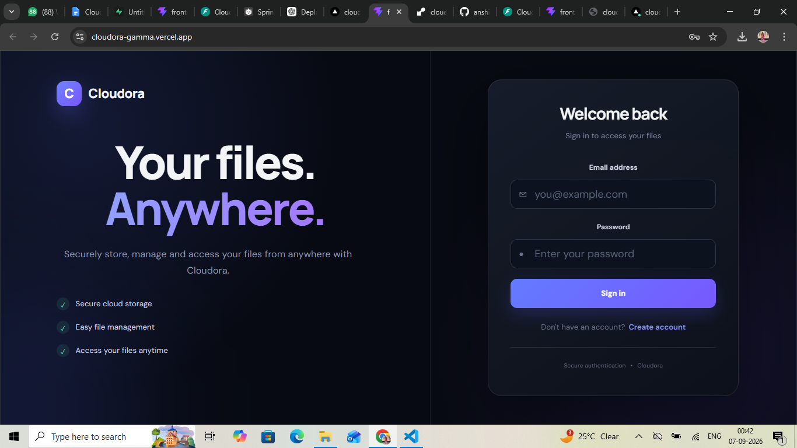
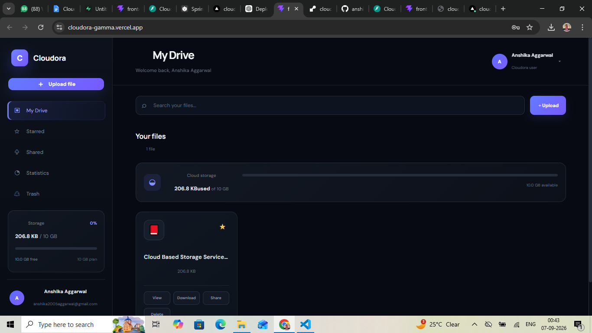
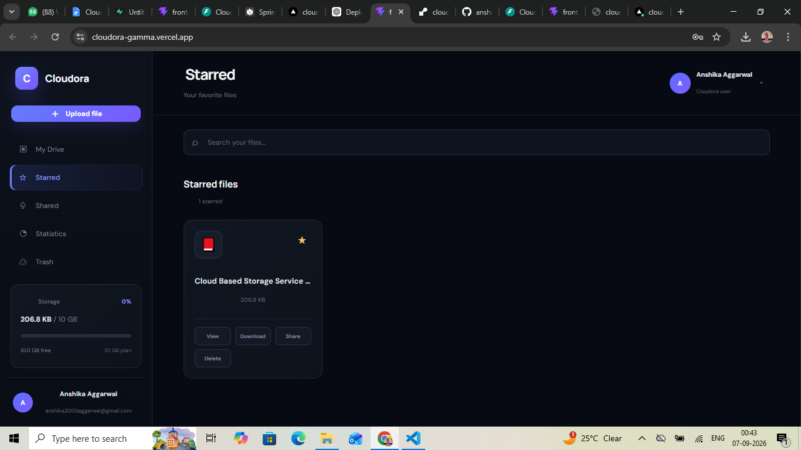
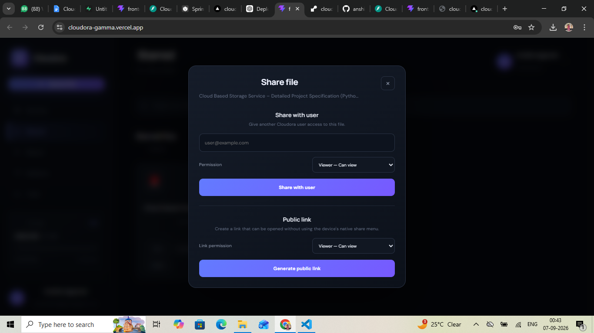
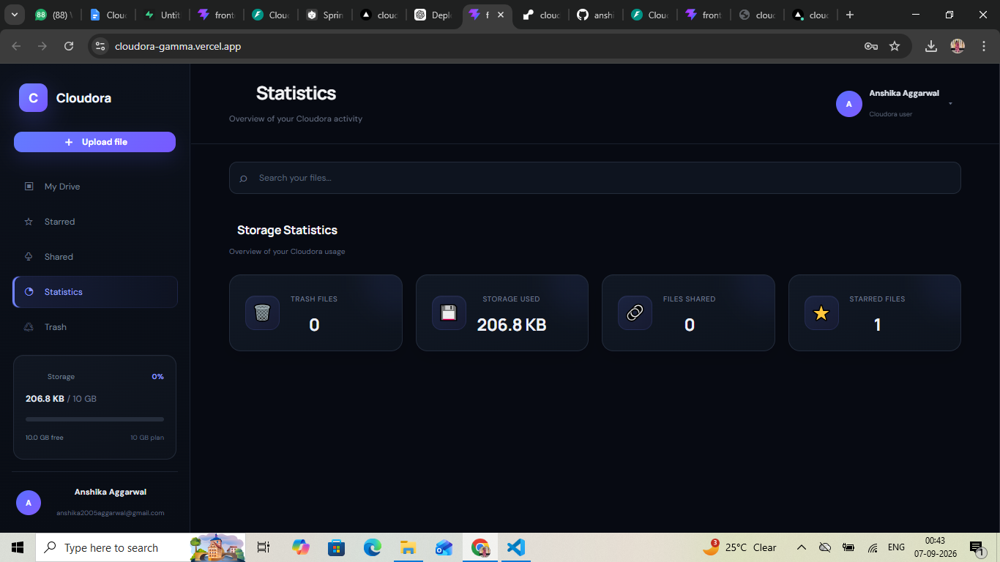
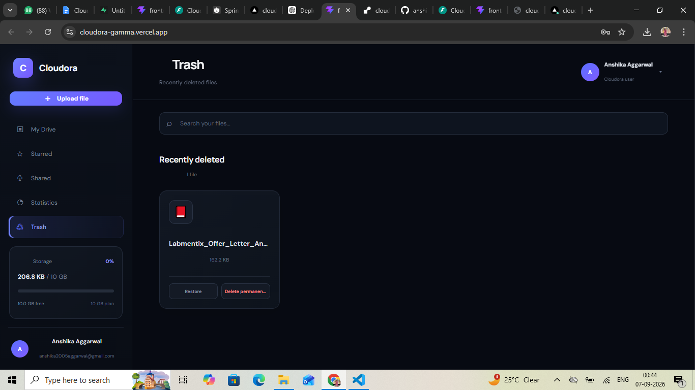
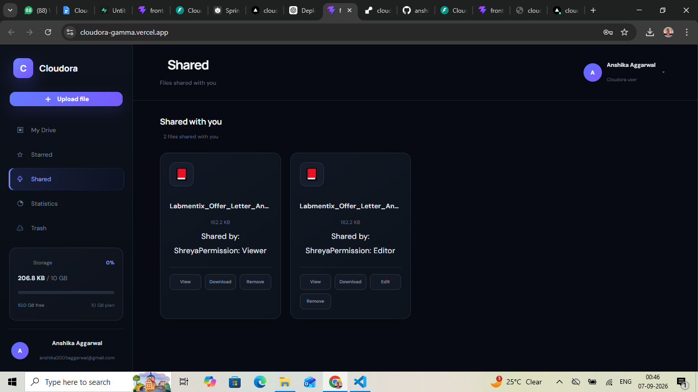

# ☁️ Cloudora

## Cloud-Based File Storage and Sharing Platform

Cloudora is a full-stack cloud storage and file-sharing platform that allows users to securely upload, manage, organize, download, and share files from anywhere.

The application provides secure authentication, file management, starred files, file sharing, public links, trash management, and storage statistics through a modern web interface.


## 🌐 Live Demo

**Live Website:**  
https://cloudora-gamma.vercel.app/


## ✨ Features

- 🔐 User Registration and Login
- 🔒 Secure User Authentication
- 📁 Upload and Manage Files
- ⬇️ Download Files
- ⭐ Star Important Files
- 🤝 Share Files with Other Users
- 👤 Viewer and Editor Permissions
- 🔗 Generate Public File Links
- 🗑️ Move Files to Trash
- ♻️ Restore Deleted Files
- ❌ Permanently Delete Files
- 📊 View Storage Statistics
- 🔎 Search Files


## 🖥️ Screenshots

### 🔐 Login




### 📁 My Drive




### ⭐ Starred Files




### 🤝 File Sharing




### 📊 Statistics




### 🗑️ Trash




### 👥 Shared Files




## 🛠️ Tech Stack

### Frontend

- React.js
- Vite
- JavaScript
- Axios
- Tailwind CSS


### Backend

- Python
- FastAPI
- SQLAlchemy
- JWT Authentication
- Passlib
- Bcrypt
- Python-JOSE


### Database

- Supabase


### Deployment

- GitHub
- Vercel
- Render


## 🏗️ System Architecture

```text
                         ┌───────────────────┐
                         │       User        │
                         │      Browser      │
                         └─────────┬─────────┘
                                   │
                                   ▼
                         ┌───────────────────┐
                         │   React + Vite    │
                         │     Frontend      │
                         │      Vercel       │
                         └─────────┬─────────┘
                                   │
                              REST API
                                   │
                                   ▼
                         ┌───────────────────┐
                         │      FastAPI      │
                         │      Backend      │
                         │      Render       │
                         └─────────┬─────────┘
                                   │
                                   ▼
                         ┌───────────────────┐
                         │   Supabase Database │
                         └───────────────────┘
```                   
## 📂 Project Structure
```
Cloudora/
│
├── frontend/
│   ├── src/
│   ├── public/
│   ├── package.json
│   └── ...
│
├── backend/
│   ├── app/
│   │   ├── core/
│   │   ├── models/
│   │   ├── routes/
│   │   └── schemas/
│   │
│   ├── main.py
│   ├── requirements.txt
│   └── ...
│
├── screenshots/
│   ├── login.png
│   ├── dashboard.png
│   ├── star.png
│   ├── share_link_.png
│   ├── stats.png
│   ├── trash.png
│   └── shared.png
│
└── README.md
```
## 🔐 Security

Cloudora implements multiple security mechanisms to protect user accounts and files.

JWT-based authentication
HTTP-only authentication cookies
Secure cookies in production
Password hashing using Bcrypt
Protected API endpoints
CORS configuration
Environment variables for sensitive information

Sensitive information such as passwords, JWT secrets, and environment variables are not included in the repository.

## 🌍 Deployment
### Frontend

The frontend is built using React and Vite and deployed on Vercel.

Live Website:
https://cloudora-gamma.vercel.app/

### Backend

The backend is built using FastAPI and deployed separately on Render.

The frontend communicates with the backend through REST APIs.

#### 🚀 Future Enhancements
#### 📂 Folder creation and nested folder management
#### 🖼️ File preview functionality
#### 🔍 Advanced search and filtering
#### 📜 File version history
#### 📧 Email notifications for file sharing
#### ☁️ Cloud object storage integration
#### 📱 Improved mobile responsiveness
#### 📊 Advanced storage analytics
#### 👨‍💼 Admin dashboard